  

  
  
  

## About

I’m a full-stack engineer and content creator focused on building scalable, polished software across mobile, backend, and web.

- Building products with **Flutter, Dart, .NET, Node.js, React, and TypeScript**
- Co-building and sharing engineering knowledge through [AstroDevs](https://github.com/AstroDevs-Team)
- Working on open-source tools, developer education, and production-grade applications

## Featured Project

### [Docsy — Modular Flutter WYSIWYG Editor](https://github.com/AstroDevs-Team/Docsy)

A Flutter-native, composable rich-text editor framework split into focused packages.

- [`docsy`](https://pub.dev/packages/docsy) — editor core
- [`docsy_toolbar`](https://github.com/AstroDevs-Team/Docsy/tree/main/packages/docsy_toolbar) — modular toolbar
- [`docsy_html`](https://github.com/AstroDevs-Team/Docsy/tree/main/packages/docsy_html) — HTML support
- [`docsy_markdown`](https://github.com/AstroDevs-Team/Docsy/tree/main/packages/docsy_markdown) — Markdown support
- [`docsy_example`](https://github.com/AstroDevs-Team/Docsy/tree/main/packages/docsy_example) — demo application

## Stack

  

## Activity

  

  

## Connect

[LinkedIn](https://linkedin.com/in/alireza-shirzad) · [AstroDevs](https://github.com/AstroDevs-Team) · [Buy Me a Coffee](https://buymeacoffee.com/astrodevs)
